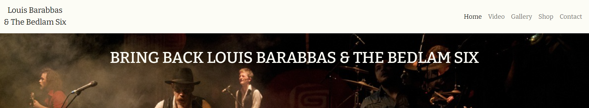
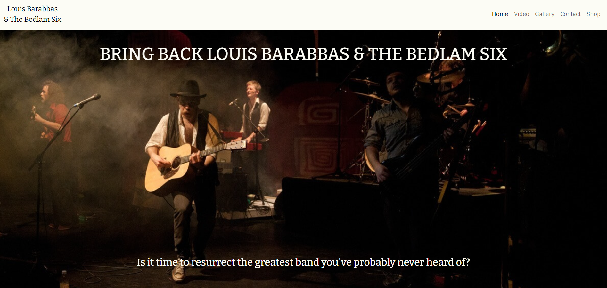
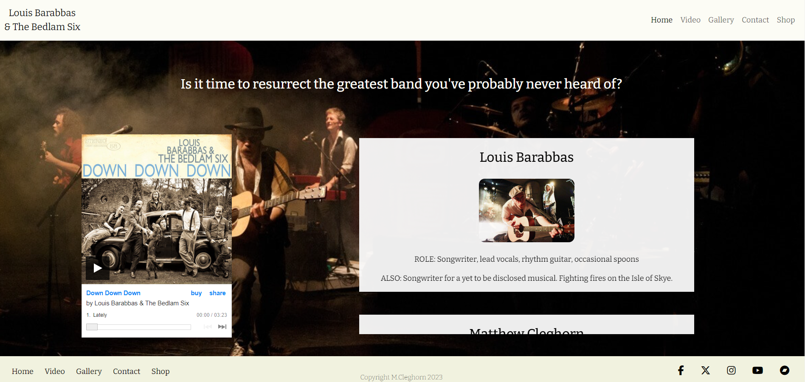
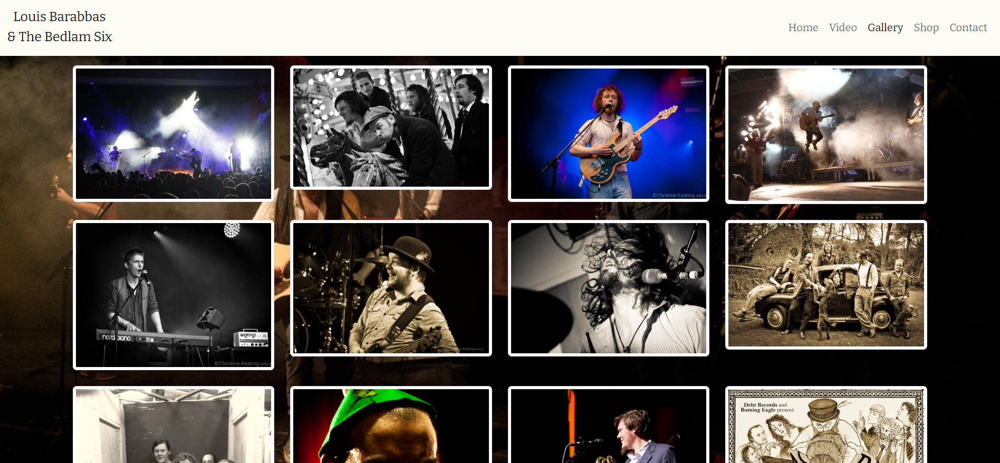
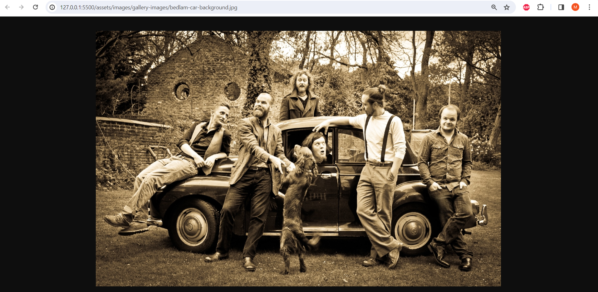
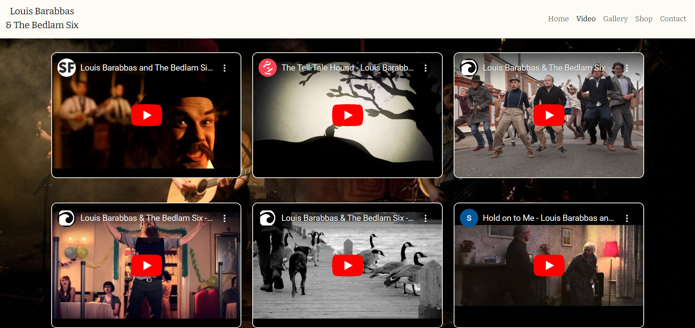
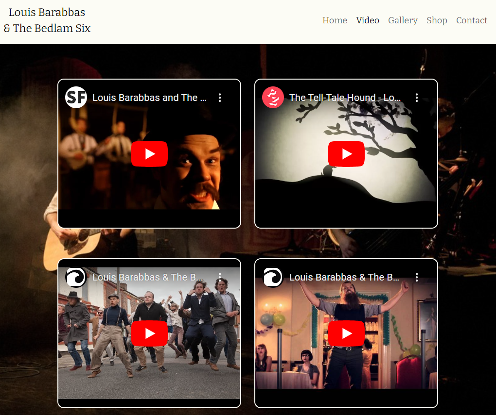
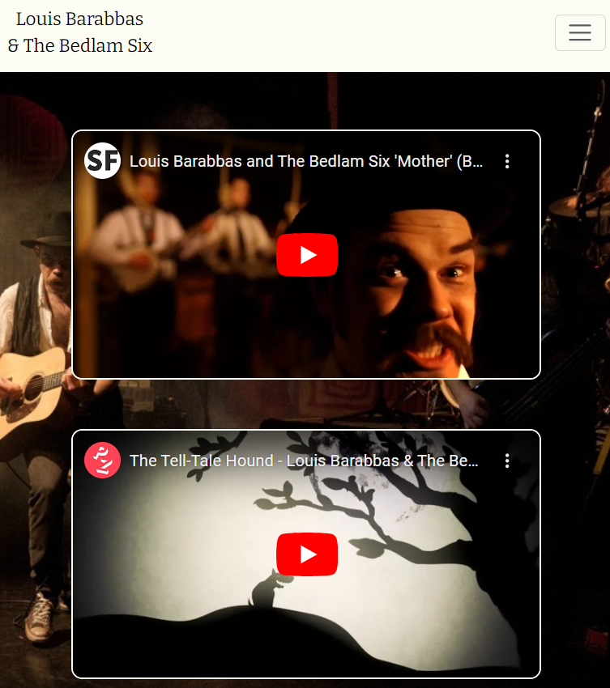
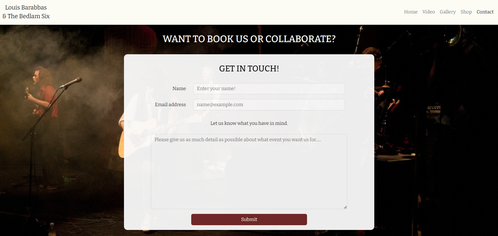
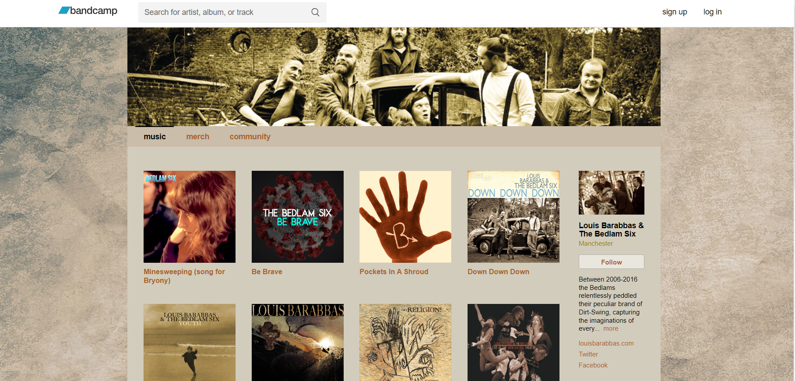

# Resurrect Louis Barabbas & The Bedlam Six

<!--  -->

Visit the deployed site here: (link to active site goes here).

Louis Barabbas & The Bedlam Six were a gloriously cacophanous musical ensemble who ceased playing live shows in 2016. This website asks the question "Is it time to bring back the greatest band you've probably never heard of?" 

This site aims to (hopefully) answer this question by showcasing music, images and videos from the band. 

In a time when grassroots music venues are disappearing on a weekly basis, I feel it's time to celebrate a band who only achieved what they achieved due to the support of such venues (how much the band actually achieved is the subject of some debate).

## CONTENTS

* [User Experience](#user-experience-ux)
  * [User Stories](#user-stories)

* [Design](#design)
  * [Colour Scheme](#colour-scheme)
  * [Background-image](#background-image)
  * [Wireframes](#wireframes)
  * [Features](#features)
    * [The Home Page](#the-home-page)
    * [The Gallery Page](#the-gallery-page)
    * [The Video Page](#the-video-page)
    * [Shop - external link to Bandcamp](#the-shop-page)
    * [Future Implementations](#future-implementations)
  * [Accessibility](#accessibility)

* [Technologies](#technologies)
  * [Languages](#languages)
  * [Frameworks, Libraries & Programs](#frameworks-libraries--programs)

* [Deployment & Local Development](#deployment--local-development)
  * [Deployment](#deployment)
  * [Local Development](#local-development)
    * [Extensions required](#extensions-required)
    * [How to Fork](#how-to-fork)
    * [How to Clone](#how-to-clone)

* [Testing](#testing)
  * [Solved Bugs](#solved-bugs)
  * [Known Bugs](#known-bugs)
  
* [Credits](#credits)
  * [External code](#external-code)
  * [Site content](#site-content)
  * [Media](#media)
  * [Acknowledgments](#acknowledgments)

  - - - 

## User Experience (UX)

### User Stories

#### First Time Visitor Goals

* I want to know who this band are and why I should care about bringing them back.
* I want the site to be responsive to the device I view it on.
* I want the site to be easy to navigate.
* I want to be able to listen to the band's music easily.
* I want to easily be able to find out who the band members are. 

#### Returning Visitor Goals

* I want to be able to find a song, video or image I liked with ease. 
* I want to be able to access the band's store to easily browse what's on offer.

#### Frequent Visitor Goals

* I want to be able to watch my favourite video, either on the site or by accessing the Youtube page from the footer.
* I want to see if there is any news on whether or not the band will be resurrected.

- - -

## Design

### Colour Scheme

All the pages of the site use the same background image so I wanted to chose a color scheme that contrasted with the image in a visually pleasing and coherent manner.

* I have used `#fcfcf51` as the text color when the background is dark & `#000000` for the text color when the background is light.
* I have used `#a10f05` as the hover color and the color of the scrollbar handle for the scrollable band member section of the home page.

  <!--  -->

### Background image

As the website is dedicated to bringing back a band few have heard of, I have chosen a background image of the band on stage for all pages. The image is mostly dark which allows text to be easily read across all pages.  

### Typography

Google Fonts was used to import the chosen fonts for use in the site.

* Throughout all of the site I have used the google font [Bitter](https://fonts.google.com/specimen/Bitter?query=bitter). Bitter has that classic, old-timey look that fits perfectly with the bands aesthetic.

### Wireframes

Wireframes were created for mobile, tablet and desktop using Justinmind.

#### Home page 

#### Video page

#### Gallery page

#### Contact page

### Features

The website makes use of Bootstrap framework for grid layouts and intuitive responsiveness.

Custom CSS was written for styling and media queries utilised for further responsiveness.

The website is comprised of a home page, a gallery page, a video page, a contact page and a link to the band's Bandcamp store.

#### The Home Page - Still not completely happy with design / layout

The home page of Resurrect Louis Barabbas & The Bedlam Six makes a bold demand in the page heading: "Bring back Louis Barabbas & The Bedlam Six" When viewd on a desktop, I have left a lot of vertical space beneath the page heading, showing the page background image almost in full before the smaller heading poses this question: "Is it time to bring back the greatest band you've probably never heard of?".

When you scroll down the home page you encounter a smaller heading directin you to the content below which comproises of a static embedded Bandcamp player on the left of the screen and a scrollable band member section on the right. 

On devices with displays of !!!px and smaller, the Bandcamp player is centered and the scrollable band member section is centred beneath the Bandcamp player.

#### The gallery page

The gallery page is thumbnail image gallery of the band and band members. A selection of color, black & white and sepia images for a pleasing visual contrast. 

All images open in a new browser tab when clicked. 

#### The Video Page

The video page is a very simple video gallery with six embedded Youtube videos. These are displayed as a 3x2 grid on large devices.

On medium devices they are displayed as a 2x3 grid.

On smaller devices, the videos are displayed in a 1x6 grid.

#### The Contact Page

The contact page comprises of a simple contact form that requires the user to input their name, email address and to provide information about the event they want to discuss with the band.

#### The Shop Page

The shop link in the header and footer link to the Bancamp page for Louis Barabbas & The Bedlam Six and opens in a new browser window / tab. 

#### Future Implementations

For future implementations of the site, I would like to:

1. Add any news (if and when anything news-worthy happens).
2. Add a tour / gigs page if the response to the site leads to a resurrection / reunion.
3. Add links to all members other projects or potentially add an extra media page showcasing those projects.
4. Create my own custom media player rather than using an embedded Bandcamp player.

### Accessibility

I have made the site with accessibility in mind and

* Using semantic HTML.
* Utilising the appropriate ARIA atrributes when needed.
* Utilising a hover state on all links on the site to make it clear to the user if they are hovering over a link (not done this yet)
* Utilising a sans serif font for the site due to being more dyslexia-friendly than other font families.
* Making sure to use contrasting colors for images and text.

- - -

## Technologies

### Languages

HTML, CSS

### Frameworks, Libraries & Programs

Bootstrap CDN (https://getbootstrap.com/)

Font awesome (https://fontawesome.com/)

Hover CSS (https://cdnjs.com/libraries/hover.css)

- - -

### Local Development

#### Extensions required

Your IDE will need to have HTML, CSS and JavaScript extensions installed.

Though no JavaScript was used in my code, some of the frameworks and libraries used need the JavaScript extension to run correctly.

#### How to Fork

To fork the repository:

1. Log in (or sign up) to Github.
2. Go to the repository for this project, [Cleg83/Resurrect-The-Bedlam-Six-Project](https://github.com/Cleg83/Resurrect-The-Bedlam-Six-Project)
3. Click the Fork button in the top right corner.

#### How to Clone

To clone the repository:

1. Log in (or sign up) to GitHub.
2. Go to the repository for this project, [Cleg83/Resurrect-The-Bedlam-Six-Project](https://github.com/Cleg83/Resurrect-The-Bedlam-Six-Project)
3. Click on the code button, select whether you would like to clone with HTTPS, SSH or GitHub CLI and copy the link shown.
4. Open the terminal in your code editor and change the current working directory to the location you want to use for the cloned directory.
5. Type 'git clone' into the terminal and then paste the link you copied in step 3. Press enter.

- - -

## Testing

Please refer to [TESTING.md](TESTING.md) for detailed testing information.

### Solved Bugs

| No | Bug | How I solved the issue |
| :--- | :--- | :--- |
| 1 | 

### Known Bugs

- - -

## Credits

### External code

* The grid layout for gallery page was taken from this page (https://startbootstrap.com/snippets/thumbnail-gallery)

* I found the solution to hiding the scrollbars on the band member section on this useful forum page (https://stackoverflow.com/questions/16670931/hide-scroll-bar-but-while-still-being-able-to-scroll)

### Site content

* Band member info /bios were taken from the band's existing (but outdated) . I have updated any outdated information.

* All page headings etc. were written by myself.

### Media

#### Image copyright

| Website image | Copyright owner |
| --- | --- |
Background image for all pages | © Andrew AB Photography (http://andrewab.photography) |
Louis bio image | © Stefan Gnad 2013 |
Cleg bio image |  © Andrew AB Photography (http://andrewab.photography) |
Tom bio image | © Christine Keating 2016 |
Fran bio image | © Andrew AB Photography (http://andrewab.photography) |
Biff bio image | © Ben Robins Photography (https://www.benrobinsphoto.com) 
Dan bio image | © Andrew AB Photography (http://andrewab.photography) |
Gallery image 1 | © Werner Gensmantel 2013 |
Gallery image 2 | © Simon Heaton |
Gallery image 3 | © Christine Keating 2012 |
Gallery image 4 | © Werner Gensmantel 2013 |
Gallery image 5 | © Christine Keating 2012 |
Gallery image 6 | © Andrew AB Photography (http://andrewab.photography)|
Gallery image 7 | © Christine Keating 2016|
Gallery image 8 | © Christine Keating 2015 |
Gallery image 9 | © Martine Nie? |
Gallery image 10 | © Debt Records |
Gallery image 11 | © Andrew AB Photography (http://andrewab.photography) |
Gallery image 12 | © Debt Records |

