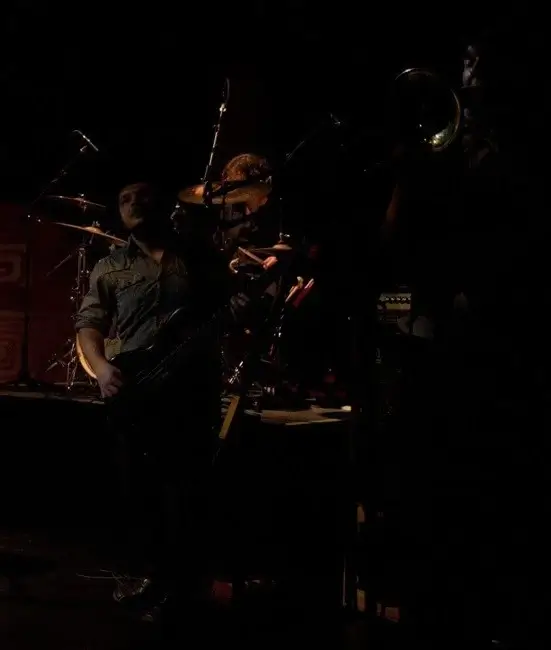
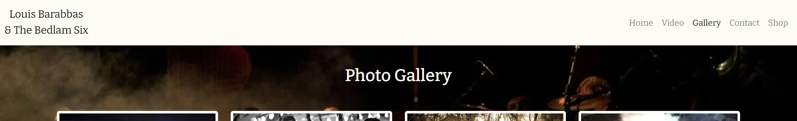
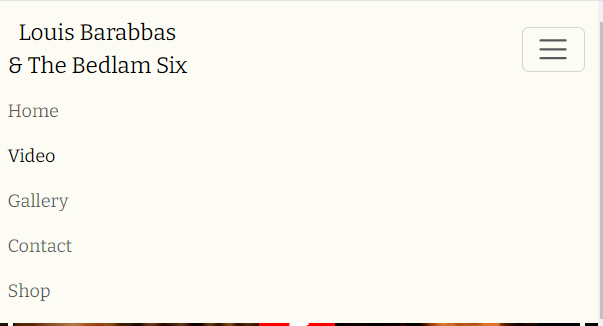
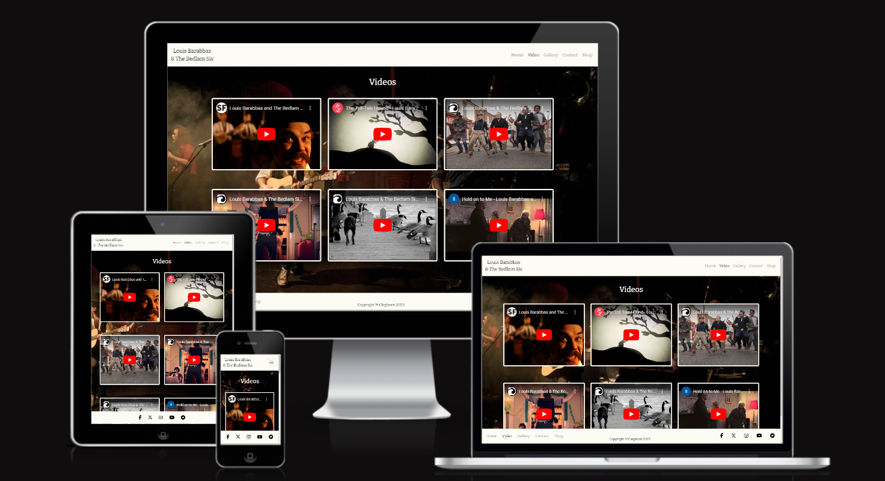
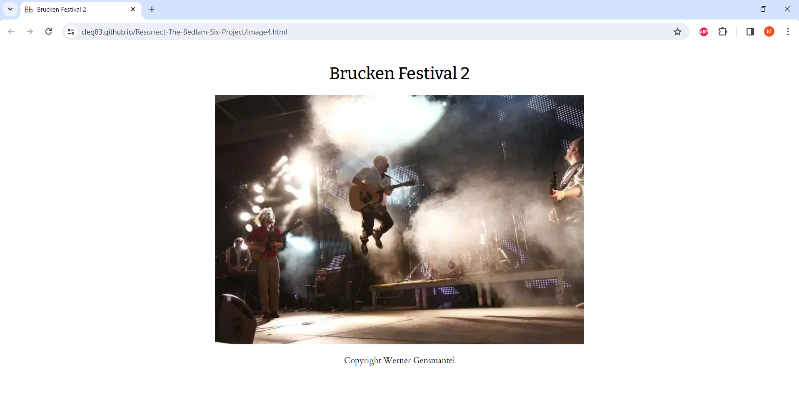

# Resurrect Louis Barabbas & The Bedlam Six

Visit the deployed site here: [Resurrect The Bedlam Six](https://cleg83.github.io/Resurrect-The-Bedlam-Six-Project/).

Louis Barabbas & The Bedlam Six were a gloriously cacophanous musical ensemble who ceased playing live shows in 2016. This website asks the question "Is it time to bring back the greatest band you've probably never heard of?" 

This site aims to (hopefully) answer this question by showcasing music, images and videos from the band. 

In a time when grassroots music venues are disappearing on a weekly basis, I feel it's time to celebrate a band who only achieved what they achieved due to the support of such venues (how much the band actually achieved is the subject of some debate).

The site serves as a simple platform to find out some basic information about the band, be able to contact them, listen to their music, watch some of their videos or be directed to the external Bandcamp shop.

## CONTENTS

* [User Experience](#user-experience-ux)
  * [User Stories](#user-stories)

* [Design](#design)
  * [Colour Scheme](#colour-scheme)
  * [Background-image](#background-image)
  * [Typography](#typography)
  * [Wireframes](#wireframes)
  * [Features](#features)
    * [The Navbar](#the-navbar)
    * [The Home Page](#the-home-page)
    * [The Footer](#the-footer)
    * [The Video Page](#the-video-page)
    * [The Gallery Page](#the-gallery-page)
    * [The Contact Page](#the-contact-page)
    * [The Submit Page](#the-submit-page)
    * [Shop - external link to Bandcamp](#the-shop-page)
    * [Future Implementations](#future-implementations)
  * [Accessibility](#accessibility)

* [Technologies](#technologies)
  * [Languages](#languages)
  * [Frameworks, Libraries & Programs](#frameworks-libraries--programs)

* [Deployment & Development](#deployment--development)
  * [Deployment](#deployment)
  * [Local Development](#local-development)
    * [Extensions required](#extensions-required)
    * [How to Fork](#how-to-fork)
    * [How to Clone](#how-to-clone)

* [Testing](#testing)
  * [Solved Bugs](#solved-bugs)
  * [Known Issues](#known-issues)
  
* [Credits](#credits)
  * [External code](#external-code)
  * [Site content](#site-content)
  * [Media](#media)

  - - - 

## User Experience (UX)

### User Stories

#### First Time Visitor Goals

* I want to know who this band are and why I should care about bringing them back.
* I want the site to be responsive to the device I view it on.
* I want the site to be easy to navigate.
* I want to be able to listen to the band's music easily.
* I want to easily be able to find out who the band members are. 

#### Returning Visitor Goals

* I want to be able to find a song, video or image I liked with ease. 
* I want to be able to access the band's store to easily browse what's on offer.

#### Frequent Visitor Goals

* I want to be able to watch my favourite video, either on the site or by accessing the Youtube page from the footer.
* I want to see if there is any news on whether or not the band will be resurrected.

- - -

## Design

### Colour Scheme

All the pages of the site have a background image so I wanted to chose a color scheme that contrasted with the image in a visually pleasing and coherent manner. 

All colors were declared as CSS variables: 

* I have used `#fcfcf5` as the text color when the background is dark & `#000000` for the text color when the background is light.
* I have also used `fcfcf5` as the color for the navbar and the footer.
* I have used `#a10f05` as the hover color and the color of the form submit buttons.
* I have used `#fafafa` with the opcacity set to 95% for the contact form background and as the background for each band member's profile. The difference is subtle but works more effectively than using `fcfcf5` for these sections.
* The --bg variable names are the backgrounds for the home page content (when hovered and when not hovered).
* The --nav-text variable is for the non-active header and footer links.

---
  

### Background images

As the website is dedicated to bringing back a band few have heard of, I have chosen a background image of the band on stage for all pages. The image is mostly dark which allows text to be easily read across all pages.  

On narrower screens, the contrast wasn't great between the image and text. As a result, the background image changes to the below on narrower screens.

---

### Typography

Google Fonts was used to import the chosen fonts for use in the site.

* For the site heading and throughout most of the site I have used the Google Font [Bitter](https://fonts.google.com/specimen/Bitter?query=bitter). Bitter has that classic, old-timey look that fits perfectly with the bands aesthetic. The header and heading text both use Bitter.

For the quotes and band member info, I opted for the Google Font [Cardo](https://fonts.google.com/specimen/Cardo).

---

### Wireframes

Wireframes were created for mobile, tablet and desktop using Justinmind.

#### Home page 

#### Video page

#### Gallery page

#### Contact page

---

### Features

The website makes use of Bootstrap framework for grid layouts and intuitive responsiveness.

Custom CSS was written for styling and media queries utilised for further responsiveness.

The website is comprised of a home page, a gallery page, a video page, a contact page and a link to the band's Bandcamp store.

All pages are fully responsive and feature a favicon icon in the browser tab:

---

#### The Navbar

I wasnted to utilise a very simple navbar layout with the band name on the left and the menu items on right. 

The band name is a link that takes you back to the home page.

On smaller screen sizes, I wanted the navbar to collapse into a hamburger menu (which Bootstrap kindly does the bulk of the work for).

The image below shows the expanded navbar and also shows that the active state of the video link.

---

#### The Home Page 

The home page of Resurrect Louis Barabbas & The Bedlam Six makes a bold demand in the page heading: "Bring back Louis Barabbas & The Bedlam Six." 

As the page loads, 2 quotes slide in from the left and two from the right. The font color fades from light to dark and a background appears. I have attempted to capture this effect in the images below:

Fewer quotes display on narrower screens, 3 quotes display on most tablets and 2 on most mobiles:

When you scroll down the home page it snaps to the section below (on devices narrower than 768px, the snap feature has been disabled).

This section opens with a heading that poses a question: smaller heading poses this question: "Is it time to bring back the greatest band you've probably never heard of?".

This section has glass like layer behind it to blur the background image and bring the home page content into focus.

Below the heading there is an embedded Bandcamp player on the left of the screen and a scrollable band member article on the right which snaps to each band member when scrolled. 

When the user hovers over the bandcamp player or the band members, the background color of the container changes to show it is in focus:

As you can see, when the band members are hovered / in focus, the padding at the top increases and the scroll bar appears. 

Also, when a user clicks on the band members a name, some more information is displayed (this is achieved by using details and summary html elements).

On devices with displays of 768px and smaller, the Bandcamp player is centered and the scrollable band member section is centred beneath the Bandcamp player.

---

#### The Footer

I wanted the footer to include the same 5 links contained in the navbar and also include the relevant social media icons. On larger screens the copyright is displayed in the center.

On tablets, the footer looks like this:

On devices narrower than 768px, only the social media icons are displayed:

---

#### The Video Page

The video page is a very simple video gallery with six embedded Youtube videos. These are displayed as a 3x2 grid on large devices.

On medium devices they are displayed as a 2x3 grid.

On smaller devices, the videos are displayed in a 1x6 grid.

When a video is hovered, the border color changes to red.

---

#### The gallery page

The gallery page is thumbnail image gallery of the band and band members. A selection of color, black & white and sepia images for a pleasing visual contrast. The grid scales down in a similar way to the video page.

All images open in a new browser tab when clicked. This required an html page to be made for each image and very basic styling to be applied (background-color and font to keep consistency).

As with the video page, when a photo is hovered, the border color changes to red.

---

#### The Contact Page

The contact page comprises of a simple contact form that requires the user to input their name, email address and to provide information about the event they want to discuss with the band.

The submit button color changes to black when hovered: 

---

#### The Submit Page

On the user submitting the contact form with all required fields completed, I wanted a new page to load that thanks the user for contacting the band and provides a link back to the home page. 

---

#### The Shop Page

The shop link in the header and footer link to the Bandcamp page for Louis Barabbas & The Bedlam Six and opens in a new browser window / tab. 

---

#### Future Implementations

For future implementations of the site, I would like to:

1. Add any news (if and when anything news-worthy happens).
2. Add a tour / gigs page if the response to the site leads to a resurrection / reunion.
3. Add links to all members other projects or potentially add an extra media page showcasing those projects.
4. Create my own custom media player rather than using an embedded Bandcamp player.
5. Improve interactivity by introducing JavaScript (this will have the added benefit of allowing me to disable third party cookies on the embedded Bandcamp and Youtube players).

---

### Accessibility

I have made the site with accessibility in mind and

* Using semantic HTML.
* Utilising the appropriate ARIA attributes when needed.
* Utilising a hover state on all links on the site to make it clear to the user if they are hovering over a link.
* Utilising sans serif fonts for the site due to being more dyslexia-friendly than other font families.
* Making sure to use contrasting colors for images and text.

- - -

## Technologies

### Languages

HTML, CSS

### Frameworks, Libraries & Programs

* [Am I Responsive?](http://ami.responsivedesign.is/) To show the website image on a range of devices.

* [Bootstrap](https://getbootstrap.com/) - For the layout of most pages.

* [Favicon.io](https://favicon.io/) To create favicon.

* [Font Awesome](https://fontawesome.com/) For social media icons.

* [Git](https://git-scm.com/) - For version control.

* [Github](https://github.com/) - To save and store the files for the website.

* [Google Fonts](https://fonts.google.com/) - To import the fonts used on the website.

* [Google Developer Tools](https://developers.google.com/web/tools) - To troubleshoot and test features, solve issues with responsiveness and styling.

* [TinyPNG](https://tinypng.com/) To compress home page images.

* [Visual Studio Code](https://code.visualstudio.com/) The IDE used to create this site.

* [Webpage Spell-Check](https://chrome.google.com/webstore/detail/webpage-spell-check/mgdhaoimpabdhmacaclbbjddhngchjik/related) - a google chrome extension that allows you to spell check your webpage. Used to check the site and the readme for spelling errors.

- - -

## Deployment & Development

### Deployment

The site is deployed using GitHub Pages - [Resurrect The Bedlam Six](https://cleg83.github.io/Resurrect-The-Bedlam-Six-Project/).

To Deploy the site using GitHub Pages:

1. Login (or signup) to Github.
2. Go to the repository for this project, [Resurrect The Bedlam Six Repo](https://github.com/Cleg83/Resurrect-The-Bedlam-Six-Project).
3. Click the settings button.
4. Select pages in the left hand navigation menu.
5. From the source dropdown select main branch and press save.
6. The site has now been deployed, please note that this process will likely  take a few minutes.

### Local Development

#### Extensions required

Your IDE will need to have HTML, CSS and JavaScript extensions installed.

Though no JavaScript was used in my code, some of the frameworks and libraries used need the JavaScript extension to run correctly.

#### How to Fork

To fork the repository:

1. Log in (or sign up) to Github.
2. Go to the repository for this project, [Cleg83/Resurrect-The-Bedlam-Six-Project](https://github.com/Cleg83/Resurrect-The-Bedlam-Six-Project)
3. Click the Fork button in the top right corner.

#### How to Clone

To clone the repository:

1. Log in (or sign up) to GitHub.
2. Go to the repository for this project, [Cleg83/Resurrect-The-Bedlam-Six-Project](https://github.com/Cleg83/Resurrect-The-Bedlam-Six-Project)
3. Click on the code button, select whether you would like to clone with HTTPS, SSH or GitHub CLI and copy the link shown.
4. Open the terminal in your code editor and change the current working directory to the location you want to use for the cloned directory.
5. Type 'git clone' into the terminal and then paste the link you copied in step 3. Press enter.

---

## Testing

Please refer to [testing.md](testing.md) for detailed testing information.

### W3C

[Home Page](documents/testing/w3c/index.png)

[Video Page](documents/testing/w3c/video.png)

[Gallery Page](documents/testing/w3c/gallery.png)

[Contact Page](documents/testing/w3c/contact.png)

[Submit Page](documents/testing/w3c/submit.png)

[CSS](documents/testing/w3c/css.png)

### Lighthouse 

[Home Page 1](documents/testing/lighthouse/index-lighthouse.png)

[Home Page 2](documents/testing/lighthouse/index-lighthouse2.png)

[Video Page](documents/testing/lighthouse/video-lighthouse.png)

[Gallery Page 1](documents/testing/lighthouse/gallery-lighthouse.png)

[Gallery Page 2](documents/testing/lighthouse/gallery-lighthouse2.png)

[Gallery Page 3](documents/testing/lighthouse/gallery-lighthouse3.png)

[Contact Page](documents/testing/lighthouse/contact-lighthouse.png)

[Submit Page](documents/testing/lighthouse/submit-lighthouse.png)

N.B. Due to recent changes to Google's third party cookie policy, the best practices scores on the pages with embedded iframes (the home page and the video page) only score 78. 

There is no way of improving this unless the embedded players are removed (not an option in this case) or a third party script is added but as this project is only HTML and CSS, that was also not an option.
- - -

## Credits

### External code

* The grid layout for the gallery page was taken from this page (https://startbootstrap.com/snippets/thumbnail-gallery)

* I found the solution to hiding the scrollbars on the band member section on this useful forum page (https://stackoverflow.com/questions/16670931/hide-scroll-bar-but-while-still-being-able-to-scroll)

* Bootstrap documentation and examples for the navbar: (https://getbootstrap.com/docs/5.3/components/navbar/)
and contact form:
(https://getbootstrap.com/docs/5.3/forms/overview/) have been incredibly useful to use as a blueprint.

* The layout for this README.md was heavily inspired by the perfect README.md shown to me by my Code Institute mentor, it can be found here (https://github.com/kera-cudmore/TheQuizArms)

### Site content

* Band member info /bios were taken from the band's existing (but outdated) [website](https://bedlamsix.com/). I have updated any outdated information.

* All page headings etc. were written by myself.

### Media

#### Image copyright

| Website image | Copyright owner |
| --- | --- |
Background image for all pages | © Andrew AB Photography (http://andrewab.photography) |
Louis bio image | © Stefan Gnad 2013 |
Cleg bio image |  © Andrew AB Photography (http://andrewab.photography) |
Tom bio image | © Christine Keating 2016 |
Fran bio image | © Andrew AB Photography (http://andrewab.photography) |
Biff bio image | © Ben Robins Photography (https://www.benrobinsphoto.com) 
Dan bio image | © Andrew AB Photography (http://andrewab.photography) |
Gallery image 1 | © Werner Gensmantel 2013 |
Gallery image 2 | © Simon Heaton |
Gallery image 3 | © Christine Keating 2012 |
Gallery image 4 | © Werner Gensmantel 2013 |
Gallery image 5 | © Christine Keating 2012 |
Gallery image 6 | © Andrew AB Photography (http://andrewab.photography)|
Gallery image 7 | © Christine Keating 2016|
Gallery image 8 | © Christine Keating 2015 |
Gallery image 9 | © Martine Nie? |
Gallery image 10 | © Debt Records |
Gallery image 11 | © Andrew AB Photography (http://andrewab.photography) |
Gallery image 12 | © Debt Records |

