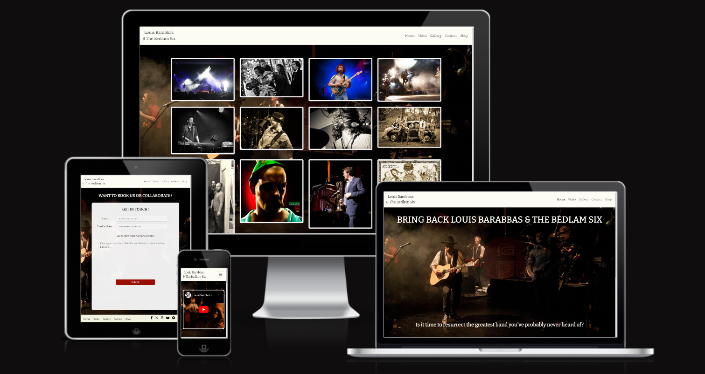

# Resurrect The Bedlam Six: Testing

Visit the deployed site here: [Resurrect The Bedlam Six](https://cleg83.github.io/Resurrect-The-Bedlam-Six-Project/).

## CONTENTS

* [Automated testing](#automated-testing)
* [Manual testing](#manual-testing)

## Automated testing

### W3C Validator

[W3C](https://validator.w3.org/) was used to validate the HTML on all pages of the website. It was also used to validate the CSS.

* [index.html](documents/testing/w3c/index.png) - Passed.
* [contact.html](documents/testing/w3c/contact.png) - Passed.
* [gallery.html](documents/testing/w3c/gallery.png) - Passed.
* [video.html](documents/testing/w3c/video.png) - Passed.
* [contact.html](documents/testing/w3c/contact.png) - Passed.
* [submit.html](documents/testing/w3c/submit.png) - Passed.
* [style.css](documents/testing/w3c/css.png) - Passed.

- - -

### To be added when site is deployed
Lighthouse tests show all scores as 90-100 with the exception of performance. However, this is likely due to it not yet being a live site and the tests being performed on the in-progresss site, running on a live server.

## Manual testing

### Home page

##### Header / Navbar 

| Feature | Expected Outcome | Testing Performed | Result | Pass/Fail |
| --- | --- | --- | --- | --- |
| Band name link | Link directs the user back to the home page | Clicked title | Home page reloads | Pass |
| Home page link | Link directs user back to the home page | Clicked on link | Home page reloads | Pass |
| Gallery link | Directs user to the gallery page | Clicked on link | Gallery page opens | Pass |
| Video link | Directs the user to the video page | Clicked on link | Video page opens | Pass |
| Shop link | Directs the user to external Bandcamp page | Clicked on link | Opens external Bandcamp page in new tab | Pass |
| Contact link | Directs users to contact page | Clicked on link | Contact page opens | Pass |
| Links: hover | The color of all links should change to #a10f0 when hovered | Moved the mouse over each header link to see if the text color changed to #a10f0 | Link changed color | Pass |

##### Home page content 

| Feature | Expected Outcome | Testing Performed | Result | Pass/Fail |
| --- | --- | --- | --- | --- |
| Embedded Bandcamp player | Plays music when the play button is clicked | Clicked button | Music plays | Pass |
| Band member column | Scrolls independently from Bandcamp Player| Scrolled through band members | Column scrolls independently | Pass |

##### Footer 

| Feature | Expected Outcome | Testing Performed | Result | Pass/Fail |
| --- | --- | --- | --- | --- |
| Home page link | Link directs user back to the home page | Clicked on link | Home page reloads | Pass |
| Gallery link | Directs user to the gallery page | Clicked on link | Gallery page opens | Pass |
| Video link | Directs the user to the video page | Clicked on link | Video page opens| Pass |
| Shop link | Directs the user to external Bandcamp page | Clicked on link | Opens external Bandcamp page in new tab | Pass |
| Contact link | Directs users to contact page | Clicked on link | Contact page opens | Pass |
| Links: hover | The color of all links should change to #a10f0 when hovered | Moved the mouse over each footer link to see if the text color changed to #a10f0 | Link changed color | Pass |
| Facebook icon link | Directs the user to external Facebook page page | Opens external Facebook page in new tab | Link changed color | Pass |
| Twitter / X icon link | Directs the user to external Twitter / X page | Opens external Twitter / X page in new tab | Link changed color | Pass |
| Instagram icon link | Directs the user to external Instagram page | Opens external Instagram page in new tab | Link changed color | Pass |
| Youtube icon link | Directs the user to external Youtube page | Opens external Youtube page in new tab | Link changed color | Pass |
| Bandcamp icon link | Directs the user to external Bandcamp page | Opens external Bandcamp page in new tab | Link changed color | Pass |

---

### Video page

##### Header / Navbar 

| Feature | Expected Outcome | Testing Performed | Result | Pass/Fail |
| --- | --- | --- | --- | --- |
| Band name link | Link directs the user back to the home page | Clicked title | Home page reloads | Pass |
| Home page link | Link directs user back to the home page | Clicked on link | Home page reloads | Pass |
| Gallery link | Directs user to the gallery page | Clicked on link | Gallery page opens | Pass |
| Video link | Directs the user to the video page | Clicked on link | Video page opens | Pass |
| Shop link | Directs the user to external Bandcamp page | Clicked on link | Opens external Bandcamp page in new tab | Pass |
| Contact link | Directs users to contact page | Clicked on link | Contact page opens | Pass |
| Links: hover | The color of all links should change to #a10f0 when hovered | Moved the mouse over each header link to see if the text color changed to #a10f0 | Link changed color | Pass |

##### Video page content 

| Feature | Expected Outcome | Testing Performed | Result | Pass/Fail |
| --- | --- | --- | --- | --- |
| Video 1 | Video plays when play button is clicked | Clicked video play button | Video plays | Pass |
| Video 2 | Video plays when play button is clicked | Clicked video play button | Video plays | Pass |
| Video 3| Video plays when play button is clicked | Clicked video play button | Video plays | Pass |
| Video 4 | Video plays when play button is clicked | Clicked video play button | Video plays | Pass |
| Video 5 | Video plays when play button is clicked | Clicked video play button | Video plays | Pass |
| Video 6 | Video plays when play button is clicked | Clicked video play button | Video plays | Pass |
| Video 1 | Allows video to play fullscreen | Clicked video fullscreen button | Video expands to full screen and plays | Pass |
| Video 2 | Allows video to play fullscreen | Clicked video fullscreen button | Video expands to full screen and plays | Pass |
| Video 3 | Allows video to play fullscreen | Clicked video fullscreen button | Video expands to full screen and plays | Pass |
| Video 4| Allows video to play fullscreen | Clicked video fullscreen button | Video expands to full screen and plays | Pass |
| Video 5 | Allows video to play fullscreen | Clicked video fullscreen button | Video expands to full screen and plays | Pass |
| Video 6 | Allows video to play fullscreen | Clicked video fullscreen button | Video expands to full screen and plays | Pass |

##### Footer 

| Feature | Expected Outcome | Testing Performed | Result | Pass/Fail |
| --- | --- | --- | --- | --- |
| Home page link | Link directs user back to the home page | Clicked on link | Home page reloads | Pass |
| Gallery link | Directs user to the gallery page | Clicked on link | Gallery page opens | Pass |
| Video link | Directs the user to the video page | Clicked on link | Video page opens | Pass |
| Shop link | Directs the user to external Bandcamp page | Clicked on link | Opens external Bandcamp page in new tab | Pass |
| Contact link | Directs users to contact page | Clicked on link | Contact page opens | Pass |
| Links: hover | The color of all links should change to #a10f0 when hovered | Moved the mouse over each footer link to see if the text color changed to #a10f0 | Link changed color | Pass |
| Facebook icon link | Directs the user to external Facebook page page | Opens external Facebook page in new tab | Link changed color | Pass |
| Twitter / X icon link | Directs the user to external Twitter / X page | Opens external Twitter / X page in new tab | Link changed color | Pass |
| Instagram icon link | Directs the user to external Instagram page | Opens external Instagram page in new tab | Link changed color | Pass |
| Youtube icon link | Directs the user to external Youtube page | Opens external Youtube page in new tab | Link changed color | Pass |
| Bandcamp icon link | Directs the user to external Bandcamp page | Opens external Bandcamp page in new tab | Link changed color | Pass |

---

### Gallery page

##### Header / Navbar 

| Feature | Expected Outcome | Testing Performed | Result | Pass/Fail |
| --- | --- | --- | --- | --- |
| Band name link | Link directs the user back to the home page | Clicked title | Home page reloads | Pass |
| Home page link | Link directs user back to the home page | Clicked on link | Home page reloads | Pass |
| Gallery link | Directs user to the gallery page | Clicked on link | Gallery page opens | Pass |
| Video link | Directs the user to the video page | Clicked on link | Video page opens | Pass |
| Shop link | Directs the user to external Bandcamp page | Clicked on link | Opens external Bandcamp page in new tab | Pass |
| Contact link | Directs users to contact page | Clicked on link | Contact page opens | Pass |
| Links: hover | The color of all links should change to #a10f0 when hovered | Moved the mouse over each header link to see if the text color changed to #a10f0 | Link changed color | Pass |

##### Gallery page content

| Feature | Expected Outcome | Testing Performed | Result | Pass/Fail |
| --- | --- | --- | --- | --- |
| Thumbnail 1 | Image open in new browser tab | Clicked thumbnail link | Opens image in new browser tab | Pass |
| Thumbnail 2 | Image open in new browser tab | Clicked thumbnail link | Opens image in new browser tab | Pass |
| Thumbnail 3 | Image open in new browser tab | Clicked thumbnail link | Opens image in new browser tab | Pass |
| Thumbnail 4 | Image open in new browser tab | Clicked thumbnail link | Opens image in new browser tab | Pass |
| Thumbnail 5 | Image open in new browser tab | Clicked thumbnail link | Opens image in new browser tab | Pass |
| Thumbnail 6 | Image open in new browser tab | Clicked thumbnail link | Opens image in new browser tab | Pass |
| Thumbnail 7 | Image open in new browser tab | Clicked thumbnail link | Opens image in new browser tab | Pass |
| Thumbnail 8 | Image open in new browser tab | Clicked thumbnail link | Opens image in new browser tab | Pass |
| Thumbnail 9 | Image open in new browser tab | Clicked thumbnail link | Opens image in new browser tab | Pass |
| Thumbnail 10 | Image open in new browser tab | Clicked thumbnail link | Opens image in new browser tab | Pass |
| Thumbnail 11 | Image open in new browser tab | Clicked thumbnail link | Opens image in new browser tab | Pass |
| Thumbnail 12 | Image open in new browser tab | Clicked thumbnail link | Opens image in new browser tab | Pass |

##### Footer 

| Feature | Expected Outcome | Testing Performed | Result | Pass/Fail |
| --- | --- | --- | --- | --- |
| Home page link | Link directs user back to the home page | Clicked on link | Home page reloads | Pass |
| Gallery link | Directs user to the gallery page | Clicked on link | Gallery page opens | Pass |
| Video link | Directs the user to the video page | Clicked on link | Video page opens | Pass |
| Shop link | Directs the user to external Bandcamp page | Clicked on link | Opens external Bandcamp page in new tab | Pass |
| Contact link | Directs users to contact page | Clicked on link | Contact page opens | Pass |
| Links: hover | The color of all links should change to #a10f0 when hovered | Moved the mouse over each footer link to see if the text color changed to #a10f0 | Link changed color | Pass |
| Facebook icon link | Directs the user to external Facebook page page | Opens external Facebook page in new tab | Link changed color | Pass |
| Twitter / X icon link | Directs the user to external Twitter / X page | Opens external Twitter / X page in new tab | Link changed color | Pass |
| Instagram icon link | Directs the user to external Instagram page | Opens external Instagram page in new tab | Link changed color | Pass |
| Youtube icon link | Directs the user to external Youtube page | Opens external Youtube page in new tab | Link changed color | Pass |
| Bandcamp icon link | Directs the user to external Bandcamp page | Opens external Bandcamp page in new tab | Link changed color | Pass |

---

### Contact page

##### Header / Navbar 

| Feature | Expected Outcome | Testing Performed | Result | Pass/Fail |
| --- | --- | --- | --- | --- |
| Band name link | Link directs the user back to the home page | Clicked title | Home page reloads | Pass |
| Home page link | Link directs user back to the home page | Clicked on link | Home page reloads | Pass |
| Gallery link | Directs user to the gallery page | Clicked on link | Gallery page opens | Pass |
| Video link | Directs the user to the video page | Clicked on link | Video page opens | Pass |
| Shop link | Directs the user to external Bandcamp page | Clicked on link | Opens external Bandcamp page in new tab | Pass |
| Contact link | Directs users to contact page | Clicked on link | Contact page opens| Pass |
| Links: hover | The color of all links should change to #a10f0 when hovered | Moved the mouse over each header link to see if the text color changed to #a10f0 | Link changed color | Pass |

##### Contact page content

| Feature | Expected Outcome | Testing Performed | Result | Pass/Fail |
| --- | --- | --- | --- | --- |
Name input field | Allows user to input text | Input text | Field allows user to input text | Pass
Email address input field | Allows user to input email address | Input email address | Field allows user to input text | Pass
Text area | Allows user to input text | Input text | Field allows user to input text | Pass | 
Submit button | Only allows users to submit if all input fields are completed | Click submit button without completing Name field | Button wouldn't allow form submission | Pass |
Submit button | Only allows users to submit if all input fields are completed | Click submit button without completing Email address field | Button wouldn't allow form submission | Pass |
Submit button | Only allows users to submit if all input fields are completed | Click submit button without inputting any text into text area | Button wouldn't allow form submission | Pass |
Submit button | Only allows users to submit if all input fields are completed | Click submit button with all fields complete| Form submitted | Pass |
Submit button | Loads submission response page when clicked | Click submit button with all fields complete| Submission response page loads | Pass |

##### Footer 

| Feature | Expected Outcome | Testing Performed | Result | Pass/Fail |
| --- | --- | --- | --- | --- |
| Home page link | Link directs user back to the home page | Clicked on link | Home page reloads | Pass |
| Gallery link | Directs user to the gallery page | Clicked on link | Gallery page opened | Pass |
| Video link | Directs the user to the video page | Clicked on link | Video page opened | Pass |
| Shop link | Directs the user to external Bandcamp page | Clicked on link | Opened external Bandcamp page in new tab | Pass |
| Contact link | Directs users to contact page | Clicked on link | Contact page opened | Pass |
| Links: hover | The color of all links should change to #a10f0 when hovered | Moved the mouse over each footer link to see if the text color changed to #a10f0 | Link changed color | Pass |
| Facebook icon link | Directs the user to external Facebook page page | Opens external Facebook page in new tab | Link changed color | Pass |
| Twitter / X icon link | Directs the user to external Twitter / X page | Opens external Twitter / X page in new tab | Link changed color | Pass |
| Instagram icon link | Directs the user to external Instagram page | Opens external Instagram page in new tab | Link changed color | Pass |
| Youtube icon link | Directs the user to external Youtube page | Opens external Youtube page in new tab | Link changed color | Pass |
| Bandcamp icon link | Directs the user to external Bandcamp page | Opens external Bandcamp page in new tab | Link changed color | Pass |

---

### Form sumission page

##### Header / Navbar 

| Feature | Expected Outcome | Testing Performed | Result | Pass/Fail |
| --- | --- | --- | --- | --- |
| Band name link | Link directs the user back to the home page | Clicked title | Home page reloads | Pass |
| Home page link | Link directs user back to the home page | Clicked on link | Home page reloads | Pass |
| Gallery link | Directs user to the gallery page | Clicked on link | Gallery page opens | Pass |
| Video link | Directs the user to the video page | Clicked on link | Video page opens | Pass |
| Shop link | Directs the user to external Bandcamp page | Clicked on link | Opens external Bandcamp page in new tab | Pass |
| Contact link | Directs users to contact page | Clicked on link | Contact page opens| Pass |
| Links: hover | The color of all links should change to #a10f0 when hovered | Moved the mouse over each header link to see if the text color changed to #a10f0 | Link changed color | Pass |

##### Form submission page content

| Feature | Expected Outcome | Testing Performed | Result | Pass/Fail |
| --- | --- | --- | --- | --- |
Cleck here to return home link | Directs user to the home page | Clicked on link | Home page opens | Pass

##### Footer 

| Feature | Expected Outcome | Testing Performed | Result | Pass/Fail |
| --- | --- | --- | --- | --- |
| Home page link | Link directs user back to the home page | Clicked on link | Home page reloads | Pass |
| Gallery link | Directs user to the gallery page | Clicked on link | Gallery page opened | Pass |
| Video link | Directs the user to the video page | Clicked on link | Video page opened | Pass |
| Shop link | Directs the user to external Bandcamp page | Clicked on link | Opened external Bandcamp page in new tab | Pass |
| Contact link | Directs users to contact page | Clicked on link | Contact page opened | Pass |
| Links: hover | The color of all links should change to #a10f0 when hovered | Moved the mouse over each footer link to see if the text color changed to #a10f0 | Link changed color | Pass |
| Facebook icon link | Directs the user to external Facebook page page | Opens external Facebook page in new tab | Link changed color | Pass |
| Twitter / X icon link | Directs the user to external Twitter / X page | Opens external Twitter / X page in new tab | Link changed color | Pass |
| Instagram icon link | Directs the user to external Instagram page | Opens external Instagram page in new tab | Link changed color | Pass |
| Youtube icon link | Directs the user to external Youtube page | Opens external Youtube page in new tab | Link changed color | Pass |
| Bandcamp icon link | Directs the user to external Bandcamp page | Opens external Bandcamp page in new tab | Link changed color | Pass |
